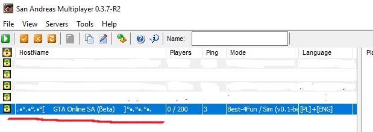

# SAMP EDGEngine

A C++17 engine based on SAMPGDK that provides convenient and high level SAMP (San Andreas Multiplayer) gamemode creation framework.

## Goals:

The main goal of *SAMP EDGEngine* is to make game mode creation process a real pleasure. User code simplicity and performance stays always at the top.

## Features:

- [x] Complete basic game mode interface: `IGameMode`
  - [x] Default "plug-and-play" game mode: `DefaultGameMode`
- [ ] Easy to use command handler interface: `ICommandHandler`
  - [x] Default "plug-and-play" command system: `DefaultCommandHandler`
- [x] Easy to use chat interface: `IChat`
  - [x] Default "plug-and-play" chat: `DefaultChat`
- [x] World management system
  - [x] Map objects
    - [x] Automatic streaming
    - [ ] Loading and saving
  - [x] Vehicles
    - [x] Automatic streaming
    - [ ] Loading and saving
  - [ ] Actors
  - [x] Gang zones
    - [ ] Loading and saving
  - [ ] Checkpoints and race system
- [ ] Easy to use `TextDraw` system
- [ ] ... possibly more

## How will my code look?

Since the engine is not fully finished yet, this section is not 100 percent sure to stay as it is. However I can make certain predictions and show sample code, that I think will do some fun stuff. Lets take a look at it:

#### 1. Running the server.
One thing I want to make significantly easier is the base server setup.
```cpp
// All-in-one header:
#include <SAMP-EDGEngine/Everything.hpp>	

// In most cases, no other code base will use `samp` namespace.
// Shorten it to `samp` for our convenciency: 
namespace samp = samp_edgengine;

// The main function:
// It is called when plugin launches.
int main()
{
    samp::Server->setupGameMode<samp::DefaultGameMode>();
}
```

#### 2. Setting server description.

To set server host name shown in SAMP client, we will use `ServerClass::setHostName` method:
```cpp
// `samp::Server` is a pointer to global object of type `ServerClass`.
samp::Server->setHostName(".•°.•°.•°[     GTA Online SA (ßeta)     ]°•.°•.°•.");
```

The result:



#### 3. Adding _basic_ command

Command parameters are passed using `CommandInput` class. Since commands are dependent on gamemode setup, from now on we will use `GameMode` global pointer. Lets see how to add simple `/heal` command:

```cpp

// # Command logic:
// Wrap the command inside `cmds` namespace (optional, good practice)
namespace cmds
{
void healPlayerCommand(samp::CommandInput input)
{
	// Player that called the command is stored inside `input.target` pointer:
	input.target->setHealth(100);
}
} // namespace cmds

int main()
{
	// # Server setup:
	// Construct new command:
	samp::GameMode->Commands->construct<samp::ProcedureCommand>(
		samp::CommandAliases{"heal", "100hp", "life"}, // List of aliases
		healPlayerCommand // a procedure to call
	);
}
```

Command construction is an interesting part:

```cpp
samp::GameMode->Commands->construct<samp::ProcedureCommand>(
	samp::CommandAliases{"heal", "100hp", "life"}, // List of aliases
	healPlayerCommand // a procedure to call
);
```

`CommandList::construct<T>` is using `T`'s constructor and forwards every argument that the method is called with. `ProcedureCommand` constructor takes two parameters.

- List of aliases (type: `std::vector<std::string>`)
- A procedure to call (type `std::function<void(CommandInput)>`)

For our convencience, there is an alias, that shortens `std::vector<std::string>`:

```cpp
using CommandAliases = std::vector<std::string>;
```
